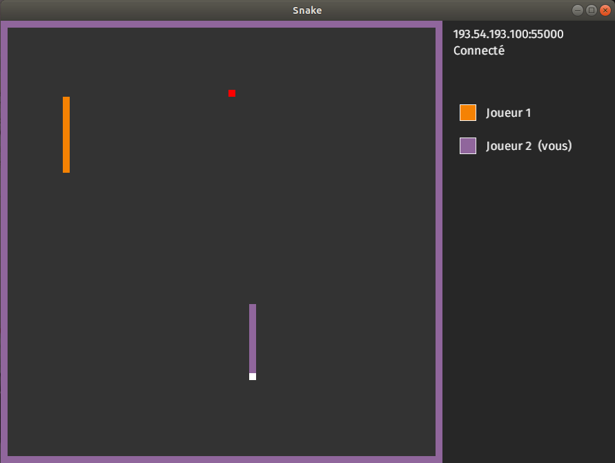

# Snecc

Un Snake multijoueur écrit en Rust en collaboration avec [@Giregm](https://github.com/Giregm).



## Utilisation

* Le serveur doit être lancé avec `./snake-server <port>` ou bien `cargo run <port>`.
* Les clients doivent être lancés avec `./snake-client <ip> <port>` ou bien `cargo run <ip> <port>`.
  * Les flèches directionnelles permettent de déplacer le serpent.
  * A la fin d'une partie, appuyez sur R pour relancer une nouvelle recherche de partie, ou appuyez sur Q/Echap pour quitter.

## Documentation

Générer la documentation (séparée) pour le client et le serveur avec :

```
cargo doc --no-deps --open
```

La spécification du protocole est disponible [ici](https://hackmd.io/@-ThAFd0wQp-n-dlrxMnqVw/ryiNPggnU).

## Todo

* Créer un écran "Connexion au serveur..." (début)
* Afficher le powerup/statut actif dans le HUD
* Idées de powerups :
  * Invisibilité temporaire
  * Invincibilité temporaire
  * Inverseur de touches de l'adversaire
  * Suppression des murs
* Stockage d'un leaderboard par IP dans un fichier sur le serveur
* ⚠️ Pour des raisons pratiques côté client, la taille de la fenêtre a été imposée, ce qui ne rend plus possible la paramétrisation de la taille de la map côté serveur
* Bug fixes
  * Quand un client se barre par exemple en plein milieu d'une game, le serveur plante
  * Petit manque de synchronisation lorsqu'on lance la game avec les deux serpents qui progressent vers la droite sans rien toucher : souvent, un serpent meurt quand même avant l'autre (alors que les deux devraient se crasher contre le mur en même temps à chaque fois, mais cela n'arrive qu'environ 1 fois sur 5)
